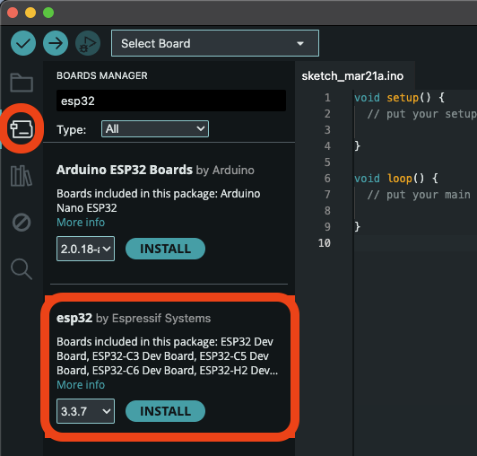
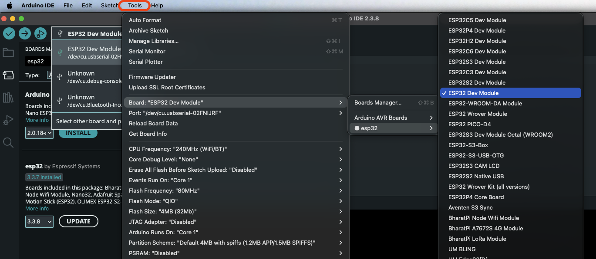
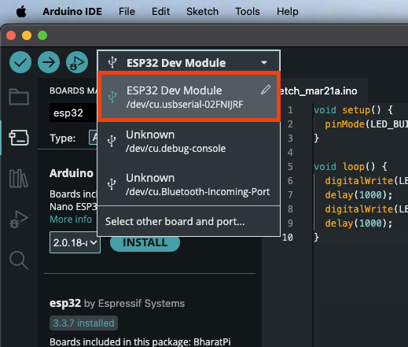
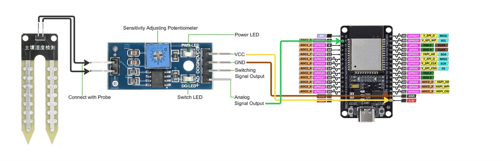
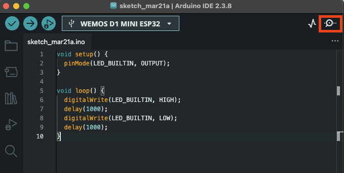
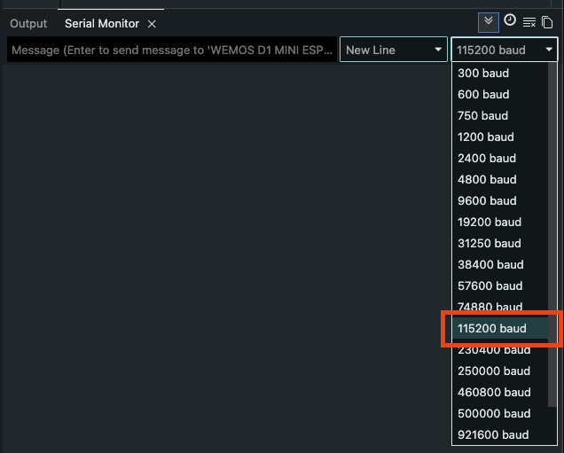

## Workshop setup

Download Arduino IDE 2 from Arduino’s official site:

https://www.arduino.cc/en/software/

Then install the ESP32 board package in Arduino IDE using Boards Manager: 



Once we've got the ESP32 library installed, we need to select it as the active board type:



Then, after connecting the ESP32 with USB-C to your laptop, ensure that you've selected the board in the dropdown:



## First upload

Before starting with the wiring. Do a quick test to see that you're able to connect to the board and upload a simple program.

1. Copy the following code and paste it into the Arduino editor: 

```cpp
const int LED_PIN = 2; 

void setup() {
  pinMode(LED_PIN, OUTPUT);
}

void loop() {
  digitalWrite(LED_PIN, HIGH);
  delay(1000);
  digitalWrite(LED_PIN, LOW);
  delay(1000);
}
```

2. Click the upload button in the top left corner.
3. Confirm the ESP32 blinks blue.

## The wiring 

Below is a diagram detailing how you shoud connect the different wires. Trial and error is the name of the game. You might have to go back to this diagram if the next steps does not yield teh expected results. 



When all wires are connected properly, the GREEN power light on the moisture sensor board should be lit. If there's no light on the board, then it means that the board doesn't get power or isnt grounded.

When you've connected the wires to the correct spots, it's time to upload the code that reads and prints out the sensor data.


## Reading sensor data

To read the sensor data, upload the code below to the board:

```ino
const int analogPin = 36;
const unsigned long sampleDelayMs = 750;
const unsigned long baudRate = 115200; // Remember this number for later

void setup() {
  Serial.begin(baudRate);
  delay(1000);
  Serial.println("Plant moisture sensor ready");
}

void loop() {
  const int rawValue = analogRead(analogPin);

  Serial.println(rawValue);

  delay(sampleDelayMs);
}
```

After you've uploaded the code to the board, you'll want to see the readings from the sensor. However, in the output console, you won't see anything. To read the output that is printed to the serial, you'll have to open the **Serial Monitor**, which is located in the top right corner:



Depending on the pre-selected baud-range, you will most likely see giberish like `�����������` in the monitor. To make sense of the values, select the baud that matches that you the `baudRate` from your code:



You should then start to see proper readings printed: 4095 means completely dry (no resistance), and 0 would be soaking wet (most likely closer to 1000).


## Connecting to the hive-mind

Last and final steps is to integrate the device with https://plant-workshop.vercel.app/ to publish the readings for the world to enjoy and admire. Head over to the page to create a new digital plant that you can send the readings to. Take note of the UUID for the plant. We'll use this to send data through the plant-API.

Paste the following code into the editor, but make sure to update the constants with the correct details:

```ino
#include <HTTPClient.h>
#include <WiFi.h>

const int analogPin = 36;
const unsigned long sampleDelayMs = 750;
const uint16_t httpTimeoutMs = 1000;

const char* wifiSsid = ""; // TODO
const char* wifiPassword = ""; // TODO
const char* plantId = ""; // TODO: Use the UUID from the Plant Platform dashboard
const char* serverBaseUrl = "https://plant-workshop.vercel.app";

bool networkConfigured() {
  return wifiSsid[0] != '\0' &&
         wifiPassword[0] != '\0' &&
         serverBaseUrl[0] != '\0' &&
         plantId[0] != '\0';
}

String readingUrl() {
  String baseUrl = String(serverBaseUrl);

  if (baseUrl.endsWith("/")) {
    baseUrl.remove(baseUrl.length() - 1);
  }

  return baseUrl + "/api/plants/" + String(plantId) + "/readings";
}

void logNetworkMessage(const char* message) {
  Serial.print("[net] ");
  Serial.println(message);
}

void startWifiIfConfigured() {
  if (!networkConfigured()) {
    return;
  }

  WiFi.mode(WIFI_STA);
  WiFi.begin(wifiSsid, wifiPassword);

  Serial.print("[net] Connecting to WiFi: ");
  Serial.println(wifiSsid);
}

void postReadingIfConnected(int rawValue) {
  if (!networkConfigured() || WiFi.status() != WL_CONNECTED) {
    return;
  }

  HTTPClient http;
  http.setConnectTimeout(httpTimeoutMs);
  http.setTimeout(httpTimeoutMs);
  http.begin(readingUrl());
  http.addHeader("Content-Type", "application/json");

  const String payload =
      "{\"rawValue\":" + String(rawValue) + ",\"source\":\"esp32-wifi\"}";

  const int responseCode = http.POST(payload);

  if (responseCode <= 0 || responseCode >= 400) {
    Serial.print("[net] API post failed: ");
    Serial.println(responseCode);
  }

  http.end();
}

void setup() {
  Serial.begin(115200);
  delay(1000);
  Serial.println("Plant platform sensor ready");

  if (networkConfigured()) {
    logNetworkMessage("WiFi/API mode enabled");
    startWifiIfConfigured();
  } else {
    logNetworkMessage("WiFi/API mode disabled; serial-only mode is active");
  }
}

void loop() {
  const int rawValue = analogRead(analogPin);

  Serial.println(rawValue);

  postReadingIfConnected(rawValue);

  delay(sampleDelayMs);
}
```

When the code has been uploaded, you should see readings update real-time on your digital plant! 🎉